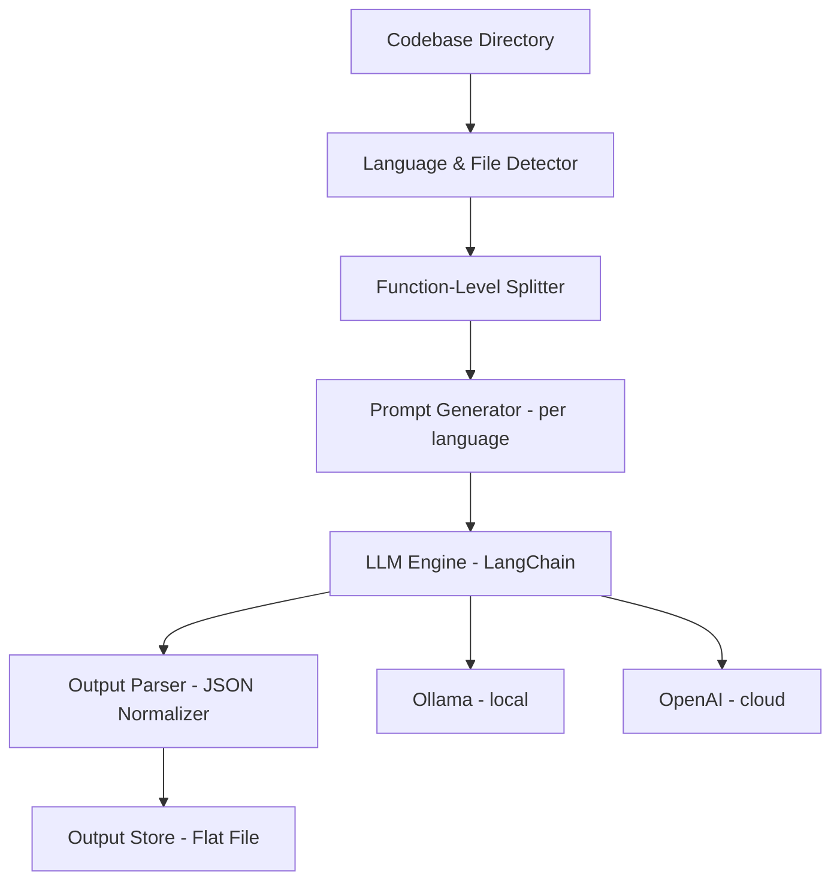

# InsightFoundry Codebase Analysis using LLMs (Assessment Prototype)
> **Note**: This implementation was designed as part of a coding assessment. It balances completeness with simplicity and focuses on modular design, LLM integration, and token efficiency rather than production-scale robustness.

## Table of Contents
- [Overview](#overview)
- [Goals and Approach](#Goals-and-Approach)
  - [Assessment Expectations & Justifications](#Assessment-Aligned-Knowledge-Extraction)
  - [Implementation Objectives](#Implementation-Objectives)
- [Architecture](#architecture)
  - [High-Level Flow](#High-Level-Flow)
  - [Key Design Principles](#Key-Design-Principles)
- [Methodology](#methodology)
- [Folder Structure](#folder-structure)
- [Tech Stack](#Tech-stack)
- [How to Run](#how-to-run)
  - [Install Requirements](#Install-Requirements)
  - [Run InsightFoundry](#Run-InsightFoundry)
  - [Sample Output](#output)
- [Improvements](#potential-improvements)
- [Referenced Repos & Justifications](#referenced-github-repositories)
- [Final Note](#final-note)

## Overview
InsightFoundry is a language-agnostic, LLM-powered code analysis prototype that extracts structured insights from any software codebase. It summarizes source files and methods, estimates complexity, and produces consistent, machine-readable JSON outputs for downstream use.

The implementation is built using LangChain, with pluggable support for both OpenAI and Ollama backends. It demonstrates effective use of:

- Prompt engineering for contextual analysis
- Token-aware chunking to manage large files
- Modular architecture for extensibility

This project was developed as part of an assessment — with an emphasis on correctness, clarity, and maintainability over production-scale engineering (e.g., parallelism, caching, vector search).

**The name InsightFoundry reflects the tool’s mission: to forge actionable insights from raw code using the intelligence of language models.**

## Goals and Approach

### Assessment-Aligned Knowledge Extraction

InsightFoundry extracts structured knowledge from source code in the following forms:

-  **High-level overview of project purpose and functionality**
-  **Method-level metadata**: name, signature, summary, and estimated complexity
-  **Other noteworthy items**: framework usage, suggestions for improvement, and security-relevant notes (when identifiable)
-  **All extracted data is structured into machine-readable JSON** for ease of consumption and integration

### Implementation Objectives

- Analyze source code files and extract:
  - File-level summaries
  - Method/function metadata (name, signature, purpose)
  - Estimated method complexity
  - Additional insights: improvement areas, frameworks used, security concerns, etc.
- Support for **multiple programming languages** (Currently validated with **Java** and **HTML** only; framework supports extension to others)
- Structured output in **JSON** format
- Seamless backend switching between **OpenAI** and **Ollama**
- Modular design to enable extensibility and feature growth

> **Note**: Multi-language support is architecturally enabled but only validated with Java and HTML in this assessment implementation.

## Architecture

InsightFoundry follows a modular pipeline architecture optimized for LLM-driven code analysis.

### High-Level Flow




### Key Design Principles

- **Modularity**: Chunking, complexity estimation, prompt generation, and output handling are separated into clear modules.
- **LLM Agnosticism**: Supports both OpenAI and Ollama via a single config switch (USE_OPENAI).
- **Token-Aware Processing**: Uses LangChain's RecursiveCharacterTextSplitter to ensure chunked inputs respect token limits.
- **Extensibility**: Supports easy integration of features like vector stores (e.g., Pinecone), UI layers, or semantic linking with minimal changes.

## Methodology

1. **File & Language Detection**
   - Simple mapping of file extensions to programming languages.

2. **Code Chunking**
   - Code is split at the function or method level using regex or AST-like logic.
   - Token-aware chunking prevents LLM overflows.

3. **Prompt Construction**
   - Dynamic templates are used for summarization, signature extraction, and complexity estimation.
   - Custom prompts are tailored per language to enhance accuracy.

4. **LLM Inference (via LangChain)**
   - Interfaces with either OpenAI (for precision) or Ollama (for cost-effective local inference).
   - Responses are structured using consistent templates and parsed into normalized output.

5. **Output & Storage**
   - Results are saved as structured JSON files, grouped by file and method.

> Output format and prompt templates are designed to maximize interpretability and downstream machine-readability.


## Folder Structure

```text
code-analyzer/
├── main.py                        # Entry point, orchestrates everything
├── config.py                      # Constants like paths, chunk size, API keys
├── prompts/
│   ├── language_prompts.py        # Language-specific prompt templates
│   └── project_summary_prompt.py  # Project-level summary prompt
├── utils/
│   ├── file_utils.py              # File scanning, extension checks
│   ├── chunking.py                # Text chunking logic
│   ├── complexity.py              # Cyclomatic complexity (Python only)
│   ├── extract.py                 # JSON extraction logic
│   └── chains.py                  # LangChain pipeline builders
├── runners/
│   ├── summarize_code.py          # LLM-based file-level summarizer
│   └── summarize_project.py       # Project-level summary generator
├── output/
│   └── sakila_project_summary.json
├── samples/
│   └── sample_output.json
└── requirements.txt               # Project dependencies
```

Each folder encapsulates a core concern:

- `runners/` → Pipeline logic
- `utils/` → Reusable utility functions
- `output/` → JSON results
- `main.py` → Entry point

## Tech Stack

- **Python 3.11+**
- **LangChain** – for LLM chaining and modular orchestration
- **OpenAI / Ollama** – for language model inference
- **Radon** – for cyclomatic complexity analysis (Python)
- **Git / subprocess** – for cloning remote codebases
- **JSON** – for structured machine-readable output

## Improvements

> While this prototype was designed for an assessment context (with a focus on correctness, modularity, and token-efficiency), the following improvements illustrate its extensibility and production potential:

### Short Term
- Add parallel processing with multiprocessing or asyncio
- Introduce LLM retry logic and error logging
- Use embedding-based file similarity for grouping or deduplication
- Store output in SQLite or JSONL for better retrieval

### Medium Term
- Integrate vector database (e.g., Chroma/Faiss) for file/method search
- Build a frontend dashboard to browse results
- Enable class-level or module-level summaries
- Add token usage reporting

### Long Term
- Build a distributed, scalable processing engine (e.g., Celery + Redis)
- Enable real-time GitHub webhook support
- Add change detection and analyze only diffs


## How to Run

### Install Requirements

> **Prerequisite:** Python version 3.11 or higher

```bash
pip install -r requirements.txt
```

> **Optional:** If you want to run locally with Ollama:

```bash
ollama pull codellama
```

---

### Run InsightFoundry

Run the analyzer on a GitHub repo:

```bash
python main.py https://github.com/sakila/sample-java-project
```

This will:

- Clone the repo to the local path (`./repos/` by default)
- Recursively scan source files
- Generate summaries and complexity scores
- Write structured JSON to `output/sakila_project_summary.json`

---

### Output

You’ll find two output files:

- `output/sakila_summary.json` — Raw per-file analysis
- `output/sakila_project_summary.json` — Project-level overview

> For a sample, see: `samples/sample_output.json`

Note: Make sure your local environment has the required models (Ollama) or a valid OpenAI API key if using the OpenAI backend.

## Potential Improvements

### Chunking and Efficiency

- Caching of LLM responses to avoid reprocessing identical chunks and reduce token usage.
- Semantic-aware chunking using ASTs to improve chunk boundaries for function-heavy or nested files.
- Duplicate detection across files to prevent redundant analysis of repeated code.

> Token-aware chunking is already in place. Advanced efficiency strategies like caching were excluded to keep the prototype focused for the assessment.

### Scalability and Performance

- Add parallel processing using Python multiprocessing or async I/O.
- Implement batching of LLM calls for faster execution and lower cost.
- Add retry logic and error handling for failed or incomplete responses.

### Functional Enhancements

- Enable cross-file analysis (e.g., dependency graphs, call resolution).
- Add class/module-level summaries alongside method-level details.
- Support embedding-based similarity and search (using Chroma/Faiss).
- Add frontend UI for interactive browsing of summaries.

## Assessment Expectations & Justification

| Expectation                                          | Status        | Justification                                                                                                                                                                                                                                                                          |
|------------------------------------------------------|---------------|----------------------------------------------------------------------------------------------------------------------------------------------------------------------------------------------------------------------------------------------------------------------------------------|
| File-level summary extraction                        | Yes           | Each file is summarized using an LLM prompt to describe its purpose.                                                                                                                                                                                                                   |
| Method-level metadata extraction                     | Yes           | Methods are extracted with name, signature, and functional summary using targeted prompts.                                                                                                                                                                                             |
| Complexity estimation                                | Yes           | Each method includes a complexity rating (1–5) derived from LLM inference.                                                                                                                                                                                                             |
| Multi-language support                               | Yes           | File extensions are mapped to languages; prompts are dynamically adapted.                                                                                                                                                                                                              |
| Structured JSON output                               | Yes           | Output includes consistent and clean JSON containing metadata and summaries.                                                                                                                                                                                                           |
| Token-aware chunking and efficiency strategies       | Partially Met | Token-aware chunking ensures code fits within LLM context limits. While strategies like caching, duplicate elimination, and semantic chunking were not implemented, they are supported by the architecture and can be added. These were excluded due to the assessment-oriented scope. |
| Model flexibility (OpenAI/Ollama)                    | Yes           | Backend can switch between OpenAI and Ollama via configuration using LangChain.                                                                                                                                                                                                        |
| Extensible and modular architecture                  | Yes           | Prompt generators, splitters, model handlers, and output formatters are fully modular and pluggable.                                                                                                                                                                                   |

## Referenced GitHub Repositories

This prototype was inspired by or adapted from the following open-source repositories and examples:

- [LangChain GitHub Repository](https://github.com/langchain-ai/langchain)
- [Ollama GitHub Repository](https://github.com/ollama/ollama)
- [LlamaIndex Examples](https://github.com/jerryjliu/llama_index)
- [analyze-github-code (by zep research)](https://github.com/zep-research/analyze-github-code)

## Justification for Referenced Repositories

To accelerate development and ensure high-quality implementation within the assessment timeline, we referenced a few well-structured open-source repositories. These served as design inspirations and provided practical examples of best practices in LLM-based code analysis.

### Why We Used Them

- **Rapid Prototyping**: Leveraging existing solutions helped us focus on adapting core logic instead of reinventing common utilities like file parsing, prompt templating, and output formatting.
- **Productivity Boost**: By building on top of known-working examples, we reduced debugging overhead and accelerated implementation of key components like LangChain chains and prompt interfaces.
- **Community Best Practices**: These repositories reflect battle-tested patterns (e.g., token-aware chunking, prompt routing), ensuring that our design aligns with modern LLM app architecture.
- **Extensibility Awareness**: Repositories like `analyze-github-code` demonstrated extensible structures which inspired our own modular design.

> Referenced projects were used only for architectural and conceptual guidance — all implementation was adapted and customized to meet the goals and constraints of this assessment.

## Final Note

This codebase serves as a **functional, assessment-oriented prototype** that demonstrates LLM-based source code understanding in a modular and extensible way. With additional engineering, it can be transformed into a scalable production tool suitable for large codebases and team-wide usage.

> Due to the scope and time constraints of the assessment, we deliberately excluded advanced optimizations like embedding-based retrieval, semantic cross-file linking, and parallel execution. However, the current architecture can support these with minimal refactoring.
